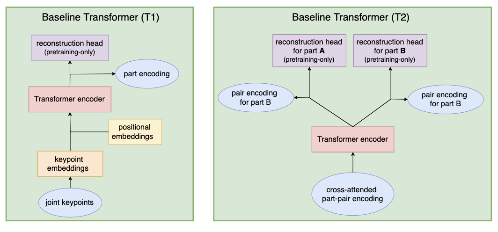
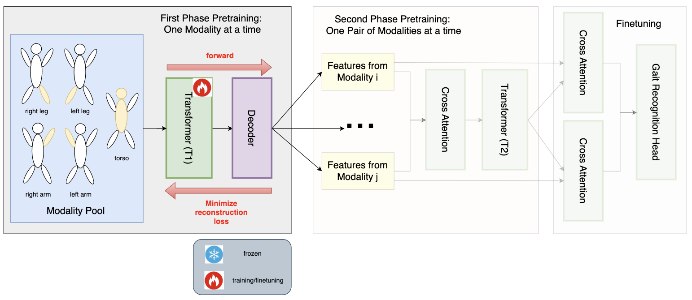
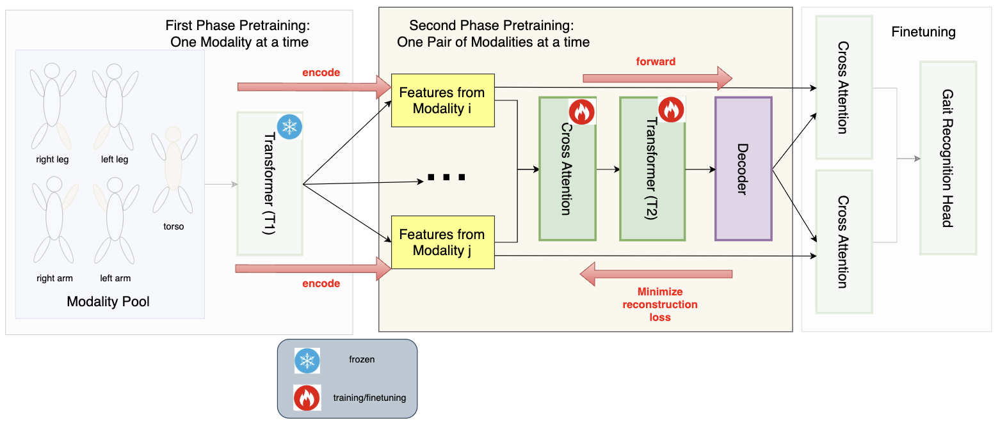
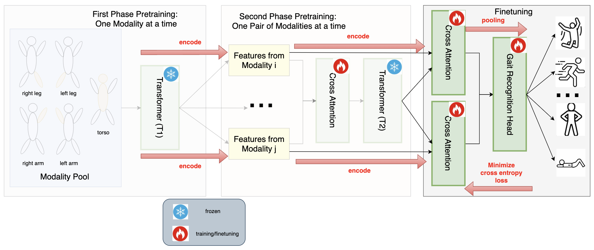

# Future Work

## Leaderboard - CascadeFormer 3.0

Baseline Transformer (T1 and T2):

First-stage pretraining:

Second-stage pretraining:

Finetuning:

| dataset | #videos | #actions | dimension | #joints | outperform SoTA? |
| ------- | ------- | -------- | --------- | ---------- | ------- |
| Penn Action, joint | 2,326 | 15 | 2D | 13 | ??? < 93.4% (HDM-BG) |
| N-UCLA, joint | 1,494 | 12 | 3D | 20 | ??? < 98.3% (SkateFormer) |
| NTU, joint | 56,880 | 60 | 3D | 25 | ??? << 92.6% (SkateFormer) - cross subject |

# Remaining potential datasets 

| dataset | #videos | #actions | dimension | #joints | outperform SoTA? |
| ------- | ------- | -------- | --------- | ---------- | ------- |
| <tr><td colspan="6" align="center"> the remaining part of the leaderboard is not done yet... </td></tr> |
| NTU | 56,880 | 60 | 3D | 25 | N/A < 92.6% (SkateFormer) - cross view |
| NTU 120 | 114,480 | 120 | 3D | 25 | N/A < 87.7%  (SkateFormer) - cross subject |
| NTU 120 | 114,480 | 120 | 3D | 25 | N/A < 89.3%  (SkateFormer) - cross view |
| Skeletics-152 | 125,657 | 152 | 3D | 25 | N/A < 56.39% (MS-G3D) | 