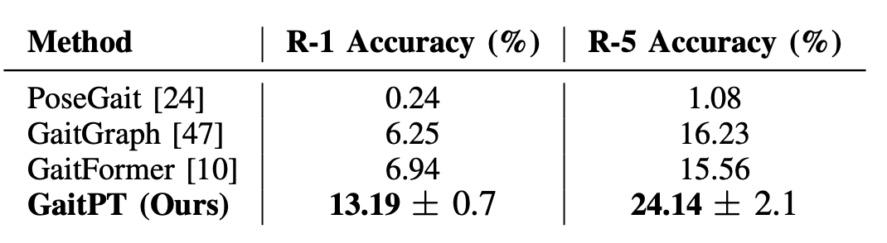
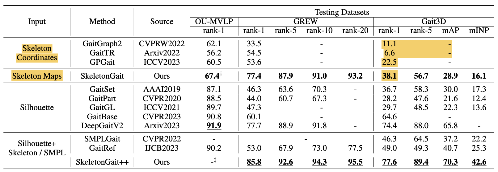
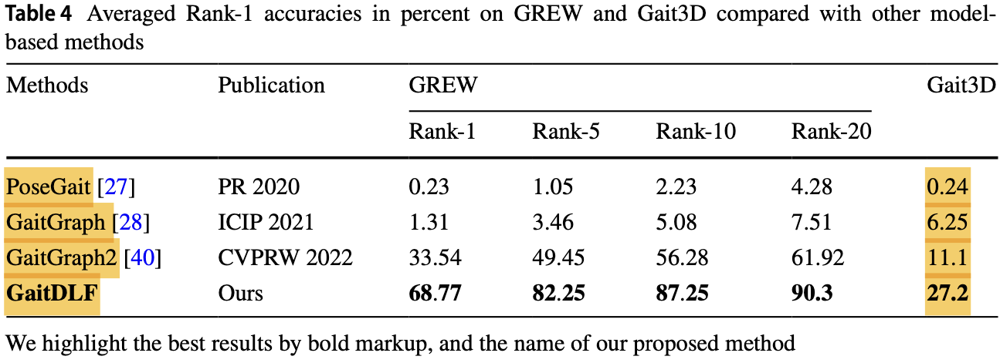
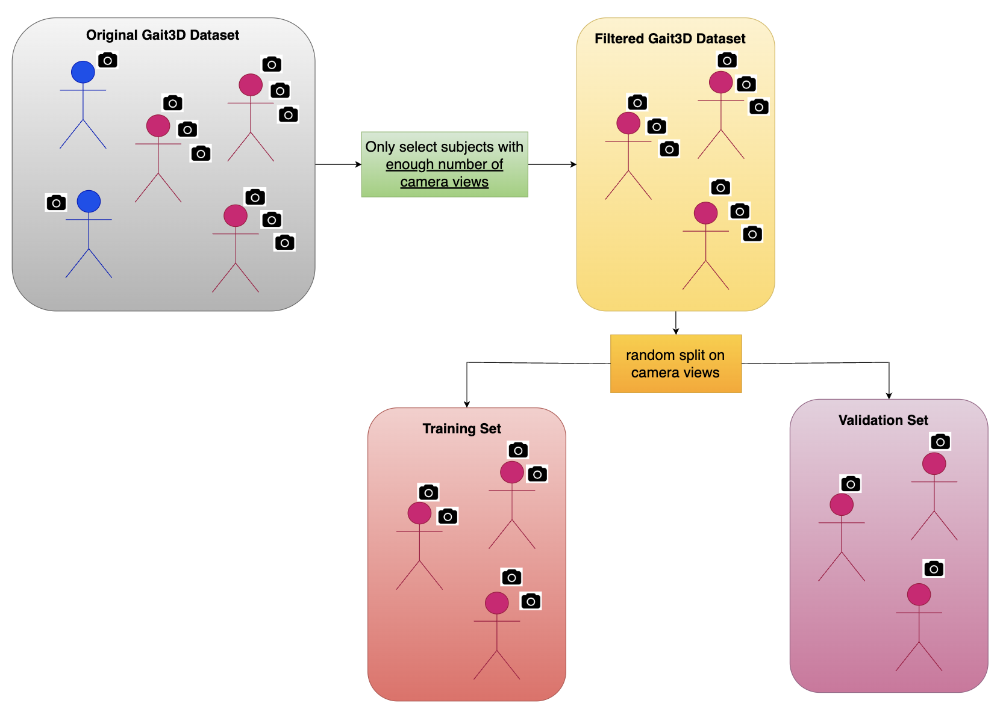
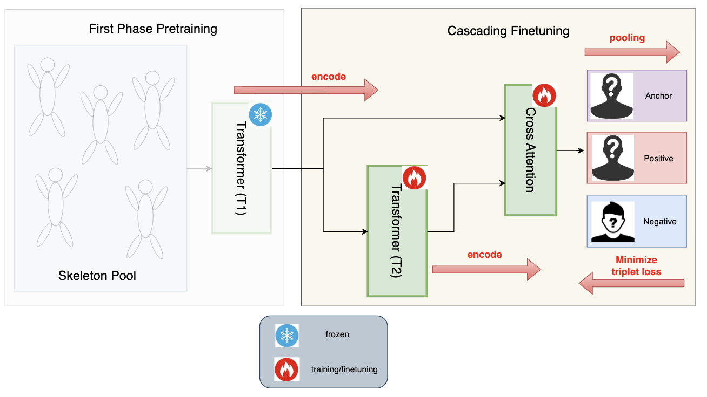

# Human Gait Recognition: a open-set retrieval problem

The definition of "open-set retrieval" from Gait3D paper for gait recognition:

*"Given a **query** sequence, we measure its similarity between all sequences in the **gallery** set. Then a ranking list of the gallery set is returned by the descending order of the similarities. We report the average Rank-1 and Rank-5 identification rates over all query sequences. We also adopt the mean Average Precision (mAP) and mean Inverse Negative Penalty (mINP) [55] which consider the recall of multiple instances and hard samples."*

## Existing State-of-the-art

PoseGait, GaitGraph, GaitFormer, GaitPT:

GaitGraph2, GaitTR, GPGait:

GaitDIF:

## Data Preprocessing of Gait3D: Camera-View-Aware Filtering

Camera-View-Aware Data Preprocessing:

## Baseline - Design (Gait Recognition)

Baseline Transformer (T1 and T2):

Pretraining:

Finetuning:

## BPMT 1.0 Design (Gait Recognition)

TBD

## Baseline - Experiment (Gait Recognition)
| #subject scanned | #subject actual | decoder | freeze T1? | T1-lr | #epochs | T2-lr (ft-lr) | #epochs | R1-acc (completely unseen people)|
|------------------|------------------|------------|------------|--------|-------------|-------------|--------|--------------------------|
| <tr><td colspan="10" align="center">Mini Experiments (n = 50/300)</td></tr> |
| 50 | 27 | linear | yes | 1e-4 | 5000 | 1e-5, wd=1e-4 | 100 | 15.75% |
| 50 | 27 | linear | no  | 1e-4 | 5000 | 1e-5, wd=1e-4 | 100 | 17.53% |
| 50 | 27 | linear | finetune layer #2 | 1e-4 | 5000 | 1e-5, wd=1e-4 | 100 | 14.71% |
| 300 | 109 | linear | yes | 1e-4 | 5000 | 1e-5, wd=1e-4 | 500 | 12.54% |
| 300 | 109 | linear | no | 1e-4 | 5000 | 1e-5, wd=1e-4 | 30 | 6.24% |
| 300 | 109 | linear | finetune layer #2 | 1e-4 | 5000 | 1e-5, wd=1e-4 | 30 | 7.02% |
| <tr><td colspan="10" align="center">Complete Experiments (n = 3000)</td></tr> |
| 3000 | 3000 | linear | yes | 1e-5 | 500 | 1e-5, wd=1e-4 | 1000 | 2.08% |
| 3000 | 3000 | linear | no | 1e-5 | 500 | 1e-5, wd=1e-4 | 200 | 2.94% |
| 3000 | 3000 | linear | no | 1e-5 | 500 | 1e-5, wd=1e-4 | 500 | 2.24% |
| 3000 | 3000 | linear | no | 1e-5 | 500 | 1e-5, wd=1e-4 | **1000** | **3.57%** |
| 3000 | 3000 | linear | no | 1e-5 | 500 | 1e-5, wd=1e-4 | **1500** | **3.03%** |

## BPMT 1.0 Experiment (Gait Recognition)
| #subject scanned | #subject actual | decoder | freeze T1? | T1-lr | #epochs | freeze T2? | T1-lr | #epochs | ft-lr | ft-#epochs | R1-acc (seen people from training) | 
|------------------|------------------|------------|------------|--------|-------------|-------------|--------|-------------|----------------|--------------------|--------------|