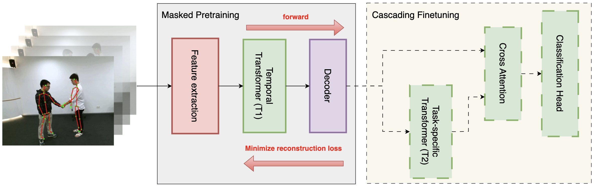
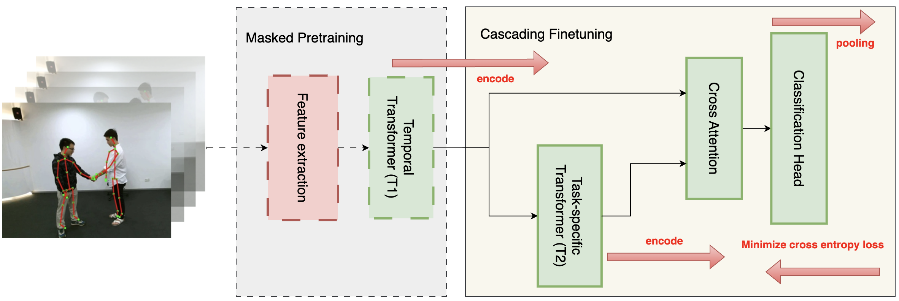
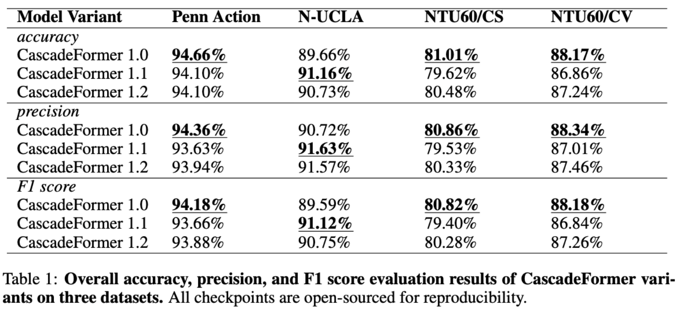

# 🌊 CascadeFormer: A Family of Two-stage Cascading Transformers for Skeleton-based Human Action Recognition

## News/Updates

- [September 16, 2025] paper under review at ICLR 2026!
- [August 31, 2025] paper available on [arXiv](https://arxiv.org/abs/2509.00692)!
- [July 19, 2025] model checkpoints are publicly available on [HuggingFace](https://huggingface.co/YusenPeng/CascadeFormerCheckpoints) for further analysis/application!

## CascadeFormer



Overview of the masked pretraining component in CascadeFormer. A fixed percentage of joints are randomly masked across all frames in each video. The partially masked skeleton sequence is passed through a feature extraction module to produce frame-level embeddings, which are then input into a temporal transformer (T1). A lightweight linear decoder is applied to reconstruct the masked joints, and the model is optimized using mean squared error over the masked positions. This stage enables the model to learn generalizable spatiotemporal representations prior to supervised finetuning.



Overview of the cascading finetuning component in CascadeFormer. The frame embeddings produced by the pre-
trained temporal transformer backbone (T1) are passed into a task-specific transformer (T2) for hierarchical refinement. The output of T2 is fused with the original embeddings via a cross-attention module. The resulting fused representations are aggregated through frame-level average pooling and passed to a lightweight classification head. The entire model—including T1, T2, and the classification head—is optimized using cross-entropy loss on action labels during finetuning.

## Evaluation



Overall accuracy evaluation results of CascadeFormer variants on three datasets. CascadeFormer 1.0 consistently
achieves the highest accuracy on Penn Action and both NTU60 splits, while 1.1 excels on N-UCLA. All checkpoints are open-
sourced for reproducibility.

## Citation

Please cite our work if you find it useful/helpful:

```bibtex
@misc{peng2025cascadeformerfamilytwostagecascading,
      title={CascadeFormer: A Family of Two-stage Cascading Transformers for Skeleton-based Human Action Recognition}, 
      author={Yusen Peng and Alper Yilmaz},
      year={2025},
      eprint={2509.00692},
      archivePrefix={arXiv},
      primaryClass={cs.CV},
      url={https://arxiv.org/abs/2509.00692}, 
}
```

## Contacts

If you have any questions or suggestions, feel free to contact:

- Yusen Peng (peng.1007@osu.edu)
- Alper Yilmaz (yilmaz.15@osu.edu)

Or describe it in Issues.


## 🔥 Ongoing follow-up Work: CascadeFormer-Agent for anomaly detection

### CascadeFormer-Agent


### Commands

```bash
# export the API key first
export OPENAI_API_KEY=<API KEY GOES HERE>
# log incidents with statistics (optional) + inference demo
CUDA_VISIBLE_DEVICES=0 taskset -c 20-30 python baseline/action_recognition/cascadeformer_1_0/joint/ntu_60_own/agent_demo.py
# reinforcement-learning
CUDA_VISIBLE_DEVICES=0 taskset -c 20-30 python baseline/action_recognition/cascadeformer_1_0/joint/ntu_60_own/agent_RL.py
# evaluation
CUDA_VISIBLE_DEVICES=0 taskset -c 20-30 python baseline/action_recognition/cascadeformer_1_0/joint/ntu_60_own/agent_eval.py
```

### RL-assisted grid search for policy thresholds

```csharp
=== Policies in the knowledge base ===
Raise an ALERT if any of the following conditions are met:
- entropy >= 0.3821
- knn_dist >= 0.1486
- mahalanobis >= 17.4800
- (1 - top1_conf) >= 0.0471
Otherwise, LOG the event as normal.
```

### test-set evaluation (preliminary)

```csharp
=== Offline Evaluation (RL Policy over RANDOM TEST Batches) ===
Samples   : 200
Accuracy  : 0.4900
Precision : 0.3108
Recall    : 1.0000
F1-score  : 0.4742
```
