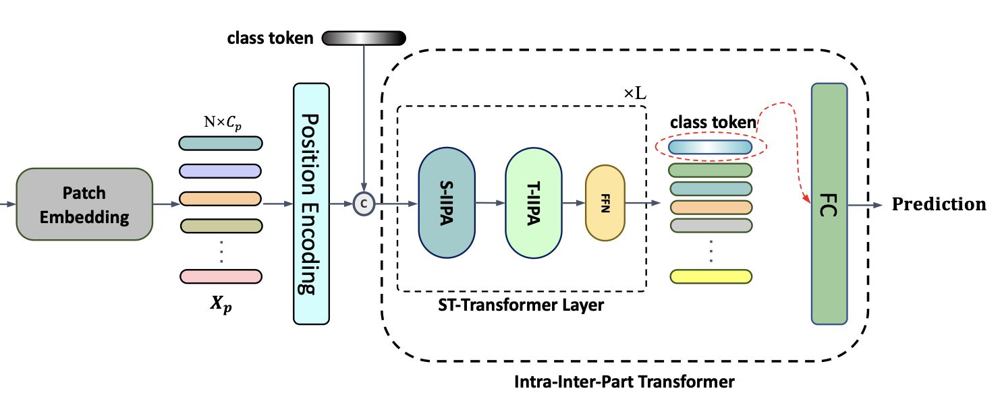
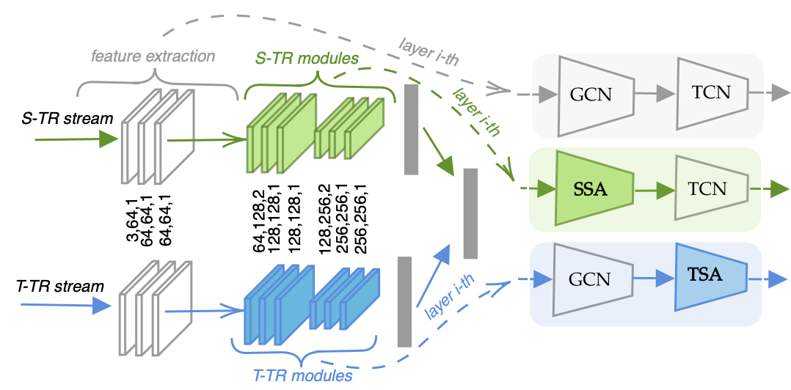
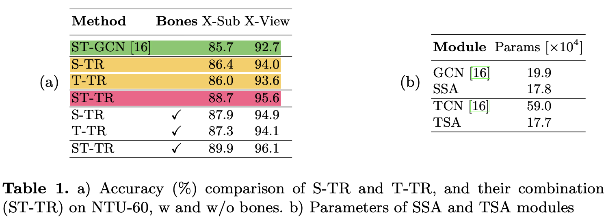
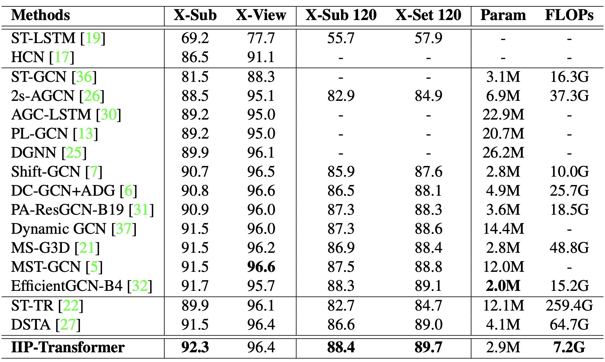
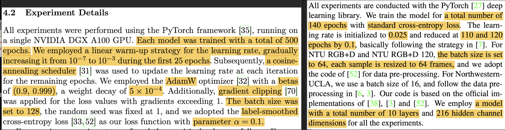
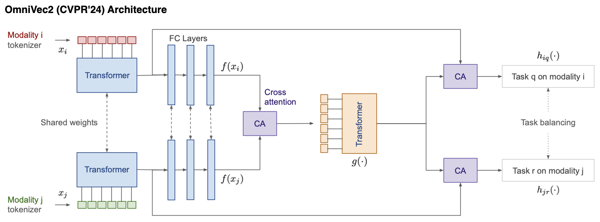
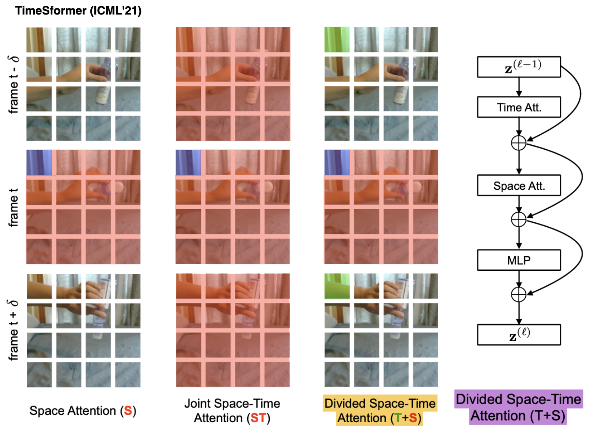
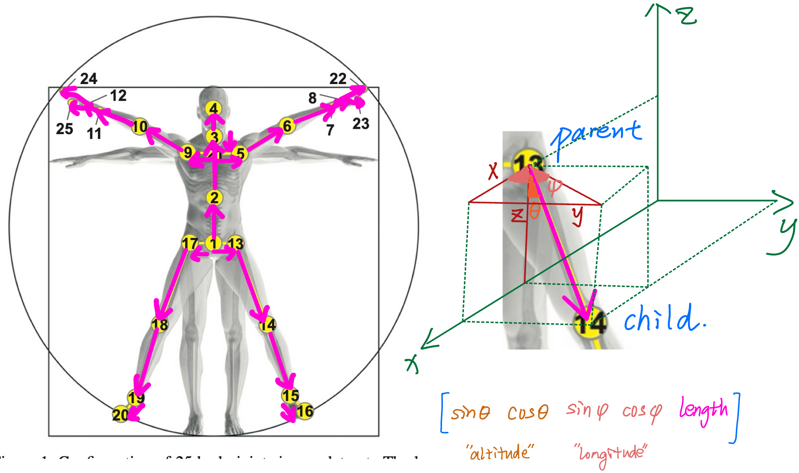
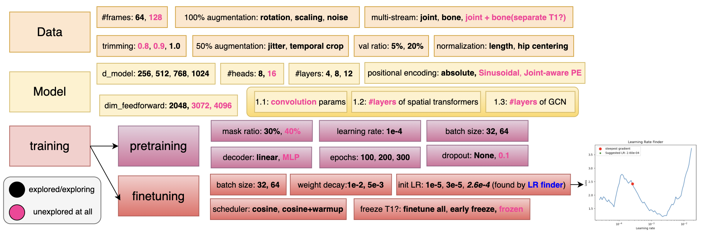
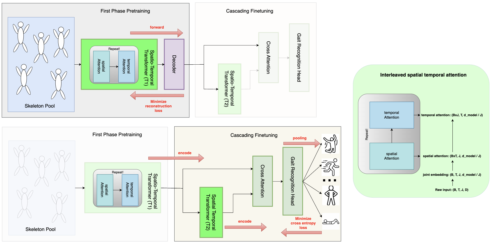

# Related Work

IIP-Transformer:

ST-TR dual stream architecture:

their results:

## Reference Training setup (SkateFormer, HyperFormer)

## Architecture inspiration from OmniVec2 (CVPR'24)

**Tokenization** matters! OmniVec2 uses TimeSformer, where each patch attends the same patch across all frames and other patches within the same frame:

Conclusion: we perhaps need to do 'smart' **joint** embedding like this instead of frame embedding 

## biomechanics-aware frame embedding 

## Tuning Diagram

## CascadeFormer 2.0 (interleaved spatial–temporal attention inspired by [IIP-Transformer](https://arxiv.org/abs/2110.13385) and [ST-TR](https://arxiv.org/abs/2012.06399))  

### result leaderboard - CascadeFormer 2.0

| dataset | #videos | #actions | dimension | #joints | outperform SoTA? |
| ------- | ------- | -------- | --------- | ---------- | ------- |
| Penn Action | 2,326 | 15 | 2D | 13 | **92.32%** = 93.4% (HDM-BG) |
| N-UCLA | 1,494 | 12 | 3D | 20 | 98.3% (SkateFormer) |
| NTU/CS | 56,880 | 60 | 3D | 25 | 92.6% (SkateFormer) |
| NTU/CV | 56,880 | 60 | 3D | 25 | 92.6% (SkateFormer) |

corresponding model checkpoints:

1. Penn Action: **92.32%** [google drive](https://drive.google.com/drive/folders/1cYQMhedWKBm93L9RWSEAj2HYGhdlucKl) - for Penn Action at least, it's very sensitive to overfitting! (sometimes fail to converge too...)
2. N-UCLA: TBD
3. NTU/CS: TBD
4. NTU/CV: TBD