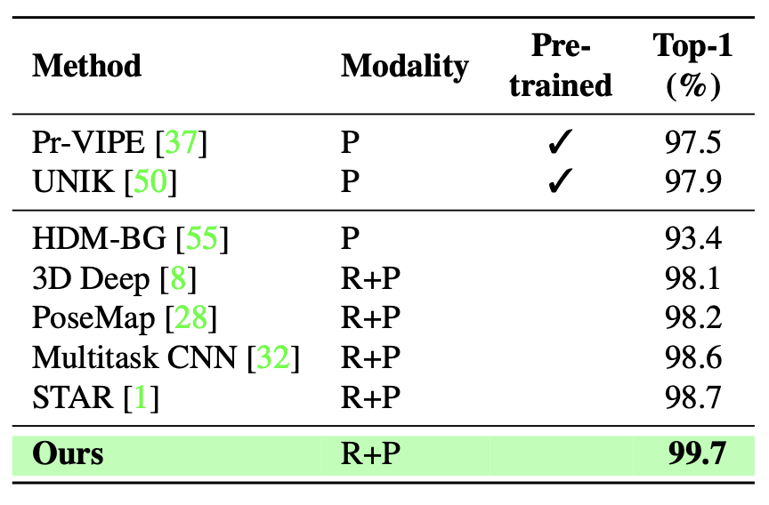
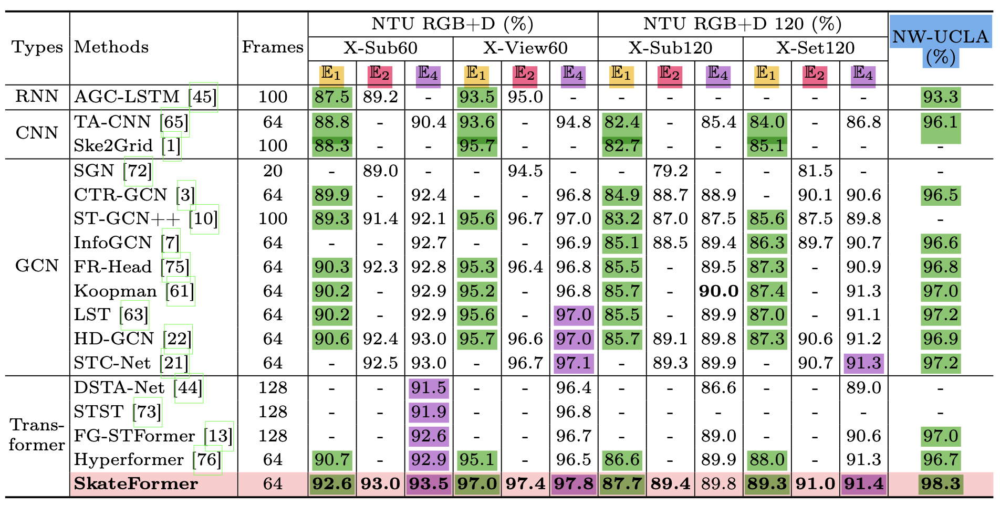

# Complete Tuning Log

## Penn Action

3DA (best) with Pr-VIPE, UNIK, HDM-BG, 3D Deep, PoseMap, MultitaskCNN, STAR: 


The complete experiment tuning logs:

| masked pretraining | decoder | d_model | n_head | num_layers | freeze T1? | T1-lr | #epochs | T2-lr (ft-lr) | #epochs | clf-acc | 
|------------------|------------|------------|------------|------------|------------|--------|-------------|-------------|--------|------------|
| <tr><td colspan="11" align="center">Complete Experiments. 5% held-out validation (n = 2326)</td></tr> |
| no | linear | 256 | 8 | 4 | yes | 1e-4 | 1000 | 1e-5, wd=1e-4 | 500 | 85.11% |
| no | linear | 256 | 8 | 4 | no  | 1e-4 | 1000 | 1e-5, wd=1e-4 | 200 | 89.70% |
| no | linear | 256 | 8 | 4 | no  | 1e-4 | 1000 | 1e-5, wd=1e-4 | **400** | **91.10%** |
| no | linear | 256 | 8 | 4 | no  | 1e-4 | 1000 | 1e-5, wd=1e-4 | **500** | **91.01%** |
| no | linear | 256 | 8 | 4 | no  | 1e-4 | 1000 | 1e-5, wd=1e-4 | 700 | 89.42% |
| no | linear | 256 | 8 | 4 | finetune layer #4 | 1e-4 | 1000 | 1e-5, wd=1e-4 | 400 | 86.89% |
| no | linear | 256 | 8 | 4 | finetune layer #4 | 1e-4 | 1000 | 1e-5, wd=1e-4 | 490 | 88.39% |
| no | MLP | 256 | 8 | 4 | no  | 1e-5 | 1000 | 1e-5, wd=1e-4 | 600 | 89.51% |
| no | MLP | 256 | 8 | 4 | no  | 1e-5 | 1000 | 1e-5, wd=1e-4 | 700 | 90.45% |
| no | MLP | 256 | 8 | 4 | no  | 1e-5 | 1000 | 1e-5, wd=1e-4 | 1000 | 89.89% |
| <tr><td colspan="11" align="center"> 30% masked pretraining - random **frames** </td></tr> |
| 30% | linear | 256 | 8 | 4 | no | 1e-4 | 500 | 1e-5, wd=1e-4 | 500 | 87.17% |
| 30% | linear | 256 | 8 | 4 | no | 1e-4 | 500 | 1e-5, wd=1e-4 | 700 | 87.27% |
| 30% | linear | 256 | 8 | 4 | no | 1e-4 | 500 | 1e-5, wd=1e-4 | 1000 | **89.23%** | 
| 30% | linear | 256 | 8 | 4 | no | 1e-4 | 500 | 1e-5, wd=1e-4 | 1500 | 87.73% | 
| 30% | MLP | 256 | 8 | 4 | no | 1e-4 | 500 | 1e-5, wd=1e-4 | 500 | 86.89% |
| 30% | MLP | 256 | 8 | 4 | no | 1e-4 | 500 | 1e-5, wd=1e-4 | 1000 | 87.45% |
| 30% | linear | 256 | 8 | 4 | no | 1e-4 | 1K | 1e-5, wd=1e-4 | 500 | 89.70% |
| 30% | linear | 256 | 8 | 4 | no | 1e-4 | 1K | 1e-5, wd=1e-4 | 1000 | **89.98%** |
| 30% | linear | 256 | 8 | 4 | no | 1e-4 | 2K | 1e-5, wd=1e-4 | 1000 | 87.36% |
| <tr><td colspan="11" align="center"> *cosine scheduler* didn't improve the performance... </td></tr> |
| 30% | linear | 256 | 8 | 4 | no | 1e-4, batch-cosine | 300 | 1e-5, wd=1e-4 | 500 | 86.99% |
| 30% | linear | 256 | 8 | 4 | no | 1e-4, batch-cosine | 300 | 1e-5, wd=1e-4 | 1000 | **88.20%** |
| 30% | linear | 256 | 8 | 4 | no | 1e-4, batch-cosine | 300 | 1e-5, wd=1e-4 | 1200 | 87.92% |
| 30% | linear | 256 | 8 | 4 | no | 1e-4, batch-cosine | 300 | 1e-5, wd=1e-4, epoch-cosine | 800 | 86.52% |
| 30% | linear | 256 | 8 | 4 | no | 1e-4, batch-cosine | 300 | 1e-5, wd=1e-4, epoch-cosine | 1000 | 86.80% |
| 30% | linear | 256 | 8 | 4 | no | 1e-4, batch-cosine | 300 | 1e-5, wd=1e-4, epoch-cosine | 1500 | 86.80% |
| <tr><td colspan="11" align="center"> 40% masked pretraining - random frames </td></tr> |
| 40% | linear | 256 | 8 | 4 | no | 1e-4 | 500 | 1e-5, wd=1e-4 | 400 | 87.55% |
| 40% | linear | 256 | 8 | 4 | no | 1e-4 | 500 | 1e-5, wd=1e-4 | 500 | **88.20%** |
| 40% | linear | 256 | 8 | 4 | no | 1e-4 | 500 | 1e-5, wd=1e-4 | 600 | 87.36% |
| 40% | linear | 256 | 8 | 4 | no | 1e-4 | 500 | 1e-5, wd=1e-4 | 700 | 87.83% |
| <tr><td colspan="11" align="center"> 20% masked pretraining - random frames  </td></tr> |
| 40% | linear | 256 | 8 | 4 | no | 1e-4 | 500 | 1e-5, wd=1e-4 | 400 | 87.73% |
| 40% | linear | 256 | 8 | 4 | no | 1e-4 | 500 | 1e-5, wd=1e-4 | 500 | 88.67% |
| 40% | linear | 256 | 8 | 4 | no | 1e-4 | 500 | 1e-5, wd=1e-4 | 700 | **89.04%** |
| 40% | linear | 256 | 8 | 4 | no | 1e-4 | 500 | 1e-5, wd=1e-4 | 1000 | 88.30% |
| 40% | linear | 256 | 8 | 4 | no | 1e-4 | 500 | 1e-5, wd=1e-4 | 1000 | 88.39% |
| <tr><td colspan="11" align="center"> 30% masked pretraining - random global joints  </td></tr> |
| 30% | linear | 256 | 8 | 4 | no | 1e-4 | 200 | 1e-5, wd=1e-4 | 200 | 91.48% |
| 30% | linear | 256 | 8 | 4 | no | 1e-4 | 200 | 1e-5, wd=1e-4 | 500 | 91.01% |
| 30% | linear | 256 | 8 | 4 | no | 1e-4 | 300 | 1e-5, wd=1e-4 | 200 | 91.67% |
| 30% | linear | 256 | 8 | 4 | no | 1e-4 | 300 | 1e-5, wd=1e-4 | 300 | 92.42% |
| 30% | linear | 256 | 8 | 4 | no | 1e-4 | 300 | 1e-5, wd=1e-4 | 350 | 91.76% |
| 30% | linear | 256 | 8 | 4 | no | 1e-4 | 300 | 1e-5, wd=1e-4 | 400 | 91.95% |
| 30% | linear | 256 | 8 | 4 | no | 1e-4 | 300 | 1e-5, wd=1e-4 | 500 | 91.39% |
| 30% | linear | 256 | 8 | 4 | no | 1e-4 | 500 | 1e-5, wd=1e-4 | 200 | 91.48% |
| 30% | linear | 256 | 8 | 4 | no | 1e-4 | 500 | 1e-5, wd=1e-4 | 300 | 91.57% |
| 30% | linear | 256 | 8 | 4 | no | 1e-4 | 500 | 1e-5, wd=1e-4 | 500 | 91.57% |
| 30% | linear | 256 | 8 | 4 | no | 1e-4 | 600 | 1e-5, wd=1e-4 | 200 | 91.20% |
| 30% | linear | 256 | 8 | 4 | no | 1e-4 | 600 | 1e-5, wd=1e-4 | 300 | 92.88% |
| 30% | linear | 256 | 8 | 4 | no | 1e-4 | 600 | 1e-5, wd=1e-4 | 400 | 92.42% |
| 30% | linear | 256 | 8 | 4 | no | 1e-4 | 600 | 1e-5, wd=1e-4 | 500 | 91.57% |
| 30% | linear | 256 | 8 | 4 | no | 1e-4 | 600 | 1e-5, wd=1e-4 | 600 | 92.13% |
| 30% | linear | 256 | 8 | 4 | no | 1e-4 | 600 | 1e-5, wd=1e-4 | 900 | 92.42% |
| 30% | linear | 256 | 8 | 4 | no | 1e-4 | 600 | 1e-5, wd=1e-4 | 1000 | 91.95% |
| 30% | linear | 256 | 8 | 4 | no | 1e-4 | **1000** | 1e-5, wd=1e-4 | **1000** | **94.66%** |
| <tr><td colspan="11" align="center"> ablation study: **too many layers** can cause overfitting... </td></tr> |
| 30% | linear | 512 | 8 | 8 | no | 1e-5 | 300 | 1e-5, wd=1e-4 | 100 | 89.89% |
| 30% | linear | 512 | 8 | 8 | no | 1e-5 | 300 | 1e-5, wd=1e-4 | 300 | 86.52% |
| <tr><td colspan="11" align="center"> ablation study: subtraction-based bones </td></tr> |
| 30%, subtraction-bone | linear | 256 | 8 | 4 | no | 1e-4 | 200 | 1e-5, wd=1e-4 | 200 | 91.76% |
| 30%, subtraction-bone | linear | 256 | 8 | 4 | no | 1e-4 | 1000 | 1e-5, wd=1e-4 | 300 | 91.67% |
| 30%, subtraction-bone | linear | 256 | 8 | 4 | no | 1e-4 | 1000 | 1e-5, wd=1e-4 | 500 | **92.32%** |
| 30%, subtraction-bone | linear | 256 | 8 | 4 | no | 1e-4 | 1000 | 1e-5, wd=1e-4 | 700 | 92.32% |
| 30%, subtraction-bone | linear | 256 | 8 | 4 | no | 1e-4 | 1000 | 1e-5, wd=1e-4 | 1000 | 90.92% |
| <tr><td colspan="11" align="center"> ablation study: concatenation-based bones </td></tr> |
| 30%, subtraction-bone | linear | 256 | 8 | 4 | no | 1e-4 | 200 | 1e-5, wd=1e-4 | 200 | 90.26% |
| 30%, subtraction-bone | linear | 256 | 8 | 4 | no | 1e-4 | 1000 | 1e-5, wd=1e-4 | 500 | 92.51% |
| 30%, subtraction-bone | linear | 256 | 8 | 4 | no | 1e-4 | 1000 | 1e-5, wd=1e-4 | 1000 | **93.16%** |
| <tr><td colspan="11" align="center"> ablation study: parameterization-based bones </td></tr> |
| 30%, subtraction-bone | linear | 256 | 8 | 4 | no | 1e-4 | 1000 | 1e-5, wd=1e-4 | 500 | **93.91%** |
| 30%, subtraction-bone | linear | 256 | 8 | 4 | no | 1e-4 | 1000 | 1e-5, wd=1e-4 | 1000 | 93.45% |
| <tr><td colspan="11" align="center"> CascadeFormer 1.1 (convolution enhanced) </td></tr> |
| 30% | linear | 256 | 8 | 4 | no | 1e-4 | 100 | 1e-5, wd=1e-4 | 100 | 89.70% |
| 30% | linear | 256 | 8 | 4 | no | 1e-4 | 200 | 1e-5, wd=1e-4 | 200 | 93.35% |
| 30% | linear | 256 | 8 | 4 | no | 1e-4 | 300 | 1e-5, wd=1e-4 | 100 | 92.51% |
| 30% | linear | 256 | 8 | 4 | no | 1e-4 | 300 | 1e-5, wd=1e-4 | 200 | 92.98% |
| 30% | linear | 256 | 8 | 4 | no | 1e-4 | 300 | 1e-5, wd=1e-4 | 300 | 92.79% |
| 30% | linear | 256 | 8 | 4 | no | 1e-4 | 500 | 1e-5, wd=1e-4 | 500 | **94.10%** |
| <tr><td colspan="11" align="center"> CascadeFormer 1.2 (spatial transformer) </td></tr> |
| 30% | linear | 256 | 8 | 4 | no | 1e-4 | 200 | 1e-5, wd=1e-4 | 100 | **94.10%** |
| 30% | linear | 256 | 8 | 4 | no | 1e-4 | 200 | 1e-5, wd=1e-4 | 120 | **94.10%** |
| 30% | linear | 256 | 8 | 4 | no | 1e-4 | 200 | 1e-5, wd=1e-4 | 200 | 94.01% |


| masked pretraining | decoder | d_model | n_head | num_layers | freeze T1? | T1-lr | #epochs | T2-lr (ft-lr) | #epochs | clf-acc |
|---------------|---------|-----------|----------|----------|----------|--------|----------|-------------|--------|---------|
| <tr><td colspan="11" align="center"> CascadeFormer 2.0 (interleaving spatial-temporal attention)  </td></tr> |
| 30% | linear | **832** | 8 | **2** | no | 1e-4 | 50 | 1e-4, wd=1e-2 | 50 | 83.15% - overfitting! |
| 30% | linear | **832** | 8 | **2** | no | 1e-4 | 100 | 1e-4, wd=1e-2 | 70 | 91.29% |
| 30% | linear | **832** | 8 | **2** | no | 1e-4 | 100 | 1e-4, wd=1e-2 | 80 | **92.32%** |
| 30% | linear | **832** | 8 | **2** | no | 1e-4 | 100 | 1e-4, wd=1e-2 | 90 | 90.73% |
| 30% | linear | **832** | 8 | **2** | no | 1e-4 | 100 | 1e-4, wd=1e-2 | 100 | 91.67% |
| 30% | linear | **832** | 8 | **2** | no | 1e-4 | 200 | 1e-4, wd=1e-2 | 100 | 86.05% - overfitting! |
| 30% | linear | **832** | 8 | **2** | no | 1e-4 | 200 | 1e-4, wd=1e-2 | 200 | 86.05% - overfitting! |


## NTU RGB+D 60

batch-level padding OR fixed-length sequence


Many folks have done data augmentation (still using only skeleton data):

1. E1: joint modality only
2. E2: joint + bone modalities
3. E4: joint + bone + joint motion + bone motion modalities

People usually: 

*train separate networks for each modality and ensemble their outputs*



The current best training setup (95%-5% train-val split):

cross-subject evaluation


## The complete experiment tuning logs

cross-subject evaluation:
| masked pretraining | decoder | d_model | n_head | num_layers | freeze T1? | T1-lr | #epochs | T2-lr (ft-lr) | #epochs | accuracy |
|--------------------|---------|---------|--------|------------|------------|--------|----------|----------------|----------|----------|
| <tr><td colspan="11" align="center"> **regular** pretraining </td></tr> |
| no | linear | 256 | 8 | 4 | no | 1e-4 | 100 | 1e-5, wd=1e-4 | 50 | 70.46% |
| no | linear | 256 | 8 | 4 | no | 1e-4 | 300 | 1e-5, wd=1e-4 | 50 | 71.33% |
| no | linear | 256 | 8 | 4 | no | 1e-4 | 300 | 1e-5, wd=1e-4 | 100 | 71.91% |
| <tr><td colspan="11" align="center"> 30% masked pretraining - random frames </td></tr>  |
| 30% | linear | 256 | 8 | 4 | no | 1e-4 | 100 | 1e-5, wd=1e-4 | 100 | 70.45% |
| 30% | linear | 256 | 8 | 4 | no | 1e-4 | 100 | 1e-5, wd=1e-4 | 300 | 71.67% |
| <tr><td colspan="11" align="center"> 30% masked pretraining - random global joints </td></tr> |
| 30% | linear | 256 | 8 | 4 | no | 1e-4 | 100 | 1e-5, wd=1e-4 | 100 | 71.27% |
| 30% | linear | 256 | 8 | 4 | no | 1e-4 | 300 | 1e-5, wd=1e-4 | 300 | 72.65% |
| 30% | linear | 256 | 8 | 4 | no | 1e-4 | 300 | 1e-5, wd=1e-4 | 500 | 72.31% |
| 30% | linear | 256 | 8 | 4 | no | 1e-4 | 500 | 1e-5, wd=1e-4 | 100 | 72.32% |
| 30% | linear | 256 | 8 | 4 | no | 1e-4 | 500 | 3e-5, wd=1e-4, cosine + warmup | 100 | 72.33% |
| 30% | linear | 256 | 8 | 4 | no | 1e-4 | 500 | 3e-5, wd=1e-4, cosine + warmup | 300 | **73.21%** |
| 30% | linear | 256 | 8 | 4 | no | 1e-4 | 500 | 3e-5, wd=1e-4, cosine + warmup | 500 | 72.94% |
| <tr><td colspan="11" align="center"> strong backbone </td></tr> |
| 30% | linear | 256 | 8 | 4 | no | 1e-4 | **1000** | 3e-5, wd=1e-4, cosine + warmup | 300 | **73.56%** |
| 30% | linear | 256 | 8 | 4 | no | 1e-4 | **1000** | 3e-5, wd=1e-4, cosine + warmup | 500 | 73.17% |
| 30% | linear | 256 | 8 | 4 | no | 1e-4 | **1000** | 3e-5, wd=1e-4, cosine + warmup | 1000 | 72.51% |
| <tr><td colspan="11" align="center"> larger model </td></tr> |
| 30% | linear | 512 | 8 | 8 | no | 1e-4 | 200 | 1e-5, wd=1e-4 | 100 | **74.79%** |
| 30% | linear | 512 | 8 | 8 | no | 1e-4 | 200 | 1e-5, wd=1e-4 | 200 | 74.75% |
| 30% | linear | 512 | 8 | **12** | no | 1e-4 | 100 | 1e-5, wd=1e-4 | 100 | **75.12%** |
| 30% | linear | 512 | 8 | **12** | no | 1e-4 | 200 | 1e-5, wd=1e-4 | 200 | **75.22%** |
| <tr><td colspan="11" align="center"> ablation study: subtraction-based bones </td></tr> |
| 30% | linear | 512 | 8 | 8 | no | 1e-4 | 100 | 1e-5, wd=1e-4 | 100 | **74.23%** |
| <tr><td colspan="11" align="center"> ablation study: concatenation-based bones </td></tr> |
| 30% | linear | 512 | 8 | 8 | no | 1e-4 | 100 | 1e-5, wd=1e-4 | 100 | **73.81%** |
| <tr><td colspan="11" align="center"> CascadeFormer 1.1 with data augmentation </td></tr> |
| 30% | linear | 512 | 8 | **12** | no | 1e-4 | 100 | 1e-5, wd=1e-4 | 100 | 70.68% |
| <tr><td colspan="11" align="center"> CascadeFormer 1.1 with trimmed-uniform random sampling  </td></tr> |
| 30%, 64+1.0 | linear | 512 | 8 | **12** | no | 1e-4 | 50 | 3e-5, wd=1e-2, CosineAnnealingWarmRestarts, epoch-level | 50 | 72.22% |
| 30%, 64+1.0 | linear | 512 | 8 | **12** | no | 1e-4 | 50 | 3e-5, wd=1e-2, CosineAnnealingWarmRestarts, batch-level | 10 | 71.84% |
| 30%, 64+1.0 | linear | 512 | 8 | **12** | no | 1e-4 | **100** | 3e-5, wd=1e-2, CosineAnnealingWarmRestarts, batch-level | 10 | 71.18% |
| 30%, 64+1.0 | linear | 512 | 8 | **12** | no | 1e-4 | **100** | 3e-5, wd=1e-2, CosineAnnealingWarmRestarts, batch-level | 20 | 70.33% |
| 30%, 64+1.0 | linear | 512 | 8 | **12** | no | 1e-4 | **100** | 3e-5, wd=1e-2, CosineAnnealingLR, epoch-level | 20 | 72.08% |
| 30%, 64+1.0 | linear | 512 | 8 | **12** | no | 1e-4 | **100** | 3e-5, wd=1e-2, CosineAnnealingLR, epoch-level | 30 | 73.01% |
| 30%, 64+1.0 | linear | 512 | 8 | **12** | no | 1e-4 | **100** | 3e-5, wd=1e-2, CosineAnnealingLR, epoch-level | 50 | 73.28% |
| 30%, 64+1.0 | linear | 512 | 8 | **12** | no | 1e-4 | **100** | 3e-5, wd=1e-2, CosineAnnealingLR, epoch-level | 100 | **73.97%** |
| 30%, 64+1.0 | linear | 512 | 8 | **12** | no | 1e-4 | **200** | 3e-5, wd=1e-2, CosineAnnealingLR, epoch-level | 20 | 71.60% |
| 30%, 64+1.0 | linear | 512 | 8 | **12** | no | 1e-4 | **200** | 3e-5, wd=1e-2, CosineAnnealingLR, epoch-level | 50 | 72.67% |
| 30%, 64+1.0 | linear | 512 | 8 | **12** | no | 1e-4 | **200** | 3e-5, wd=1e-2, CosineAnnealingLR, epoch-level | 100 | **73.22%** |
| 30%, 64+1.0 | linear | 512 | 8 | **8** | no | 1e-4 | **100** | 3e-5, wd=1e-2, CosineAnnealingLR, epoch-level | 50 | 72.78% |
| 30%, 64+1.0 | linear | 512 | 8 | **8** | no | 1e-4 | **100** | 3e-5, wd=1e-2, CosineAnnealingLR, epoch-level | 100 | 73.07% |
| <tr><td colspan="11" align="center"> a larger hidden size/latent space?! </td></tr> |
| 30%, 64+1.0 | linear | **768** | 8 | **8** | no | 1e-4 | 300 | 3e-5, wd=1e-2, CosineAnnealingLR, epoch-level | 100 | **73.48%** |
| 30%, 64+1.0 | linear | **768** | 8 | **8** | no | 1e-4 | 300 | 3e-5, wd=1e-2, CosineAnnealingLR, epoch-level | 300 | **74.10%** |
| <tr><td colspan="11" align="center"> add dropout: 0.1 for T1, 0.1 for T2, 0.5 for head </td></tr> |
| 30%, 64+1.0 | linear | **768** | 8 | **8** | no | 1e-4 | 100 | 3e-5, wd=1e-2, CosineAnnealingLR, epoch-level | 100 | 73.85% |
| <tr><td colspan="11" align="center"> hidden size 1024 </td></tr> |
| 30%, 64+1.0 | linear | **1024** | 8 | **8** | no | 1e-4 | 100 | 3e-5, wd=1e-2, CosineAnnealingLR, epoch-level | 100 | 73.61% |
| <tr><td colspan="11" align="center"> 100% augmentation </td></tr> |
| 30%, 64+1.0 | linear | **1024** | 8 | **8** | no | 1e-4 | 100 | 3e-5, wd=1e-2, CosineAnnealingLR, epoch-level | 100 | 73.33% |
| <tr><td colspan="11" align="center"> CascadeFormer 1.2 </td></tr> |
| 30%, 64+1.0 | linear | **512** | 8 | **8** | no | 1e-4 | 50 | 3e-5, wd=1e-2, CosineAnnealingLR, epoch-level | 50 | 71.79% |
| 30%, 64+1.0 | linear | **512** | 8 | **8** | freeze-25-unfreeze | 1e-4 | 100 | 2.6e-4, wd=5e-3, CosineAnnealingLR, batch-level | 100 | 72.10% |
| 30%, 64+1.0 | linear | **400, revised** | 8 | **8** | no | 1e-4 | 100 | 2.6e-4, wd=5e-3, CosineAnnealingLR, batch-level | 100 | **73.56%** |
| <tr><td colspan="11" align="center"> CascadeFormer 1.3 (GCN) </td></tr> |
| 30%, 64+1.0 | linear | **400, revised** | 8 | **8** | no | 1e-4 | 100 | 2.6e-4, wd=5e-3, CosineAnnealingLR, batch-level | 100 | **68.98%** |
| <tr><td colspan="11" align="center"> CascadeFormer 1.1 but biomechanics-aware frame embeddings </td></tr> |
| 30%, 64+1.0, bioaware | linear | **256** | **8** | **8** | no | 1e-4 | 100 | 3e-5, wd=1e-2, CosineAnnealingLR, batch-level | 100 | **73.36%** |
| 30%, 64+1.0, bioaware | linear | **768** | **16** | **16** | no | 1e-4, CosineAnnealingLR | 400 | 3e-5, wd=1e-2, CosineAnnealingLR, batch-level | 100 | TBD |
| 30%, 64+1.0, bioaware | linear | **768** | **16** | **16** | no | 1e-4, CosineAnnealingLR | 400 | 3e-5, wd=1e-2, CosineAnnealingLR, batch-level | 200 | TBD |
| 30%, 64+1.0, bioaware | linear | **768** | **16** | **16** | no | 1e-4, CosineAnnealingLR | 400 | 3e-5, wd=1e-2, CosineAnnealingLR, batch-level | 400 | **running** - CUDA_VISIBLE_DEVICES=1 nohup taskset -c 21-30 python3 baseline/action_recognition/cascadeformer_1_0/joint/ntu_60_own/NTU_main.py --pretrain --num_epochs 400 > large_bioaware_1_0.txt 2>&1 & |
| <tr><td colspan="11" align="center"> CascadeFormer 2.0 </td></tr> |
| 30%, 64+1.0 | linear | **800** | 8 | **2** | no | 1e-4 | 100 | 3e-5, wd=1e-2, CosineAnnealingLR, epoch-level | 100 | 54.48% |
| 30%, 64+1.0 | linear | **800** | 8 | **2** | no | 1e-4 | 100 | 3e-5, wd=1e-2, CosineAnnealingLR, epoch-level | 100 | 58.29%, 20% validation |
| 30%, 64+1.0 | linear | **800** | 8 | **4** | no | 1e-4 | 25 | 3e-5, wd=1e-2, CosineAnnealingLR, epoch-level | 25 | 58.29%, 20% validation |

## Baseline - Experiment (NW-UCLA, cross-view)


The current best training setup (95%-5% train-val split):

| masked pretraining | decoder | d_model | n_head | num_layers | freeze T1? | T1-lr | #epochs | T2-lr (ft-lr) | #epochs | accuracy |
|------------------|------------|------------|------------|------------|------------|--------|-------------|-------------|--------|------------|
| 30%, SF data loader | linear | 256 | 8 | 4 | no | 1e-4 | 1000 | 3e-5, wd=1e-4, cosine + warmup | 300 | **88.79%** |

## The complete experiment tuning logs:

Use SkateFormer data loader instead of my own data loader because:

1. normalization: first-joint centering; min-max normalization
2. regularization: random rotation, random scaling, random sampling, random dropout (joint/axis)
3. data augmentation: dataset duplication (repeat N=10 times)

| masked pretraining | decoder | d_model | n_head | num_layers | freeze T1? | T1-lr | #epochs | T2-lr (ft-lr) | #epochs | accuracy |
|--------------------|---------|---------|--------|------------|------------|--------|----------|----------------|----------|----------|
| <tr><td colspan="11" align="center"> small backbone </td></tr> |
| 30%, SF data loader | linear | 256 | 8 | 4 | no | 1e-4 | 100 | 3e-5, wd=1e-4, cosine + warmup | 20 | 84.48% |
| 30%, SF data loader | linear | 256 | 8 | 4 | no | 1e-4 | 100 | 3e-5, wd=1e-4, cosine + warmup | 50 | 86.64% | 
| 30%, SF data loader | linear | 256 | 8 | 4 | no | 1e-4 | 100 | 3e-5, wd=1e-4, cosine + warmup | 100 | 85.13% |
| 30%, SF data loader | linear | 256 | 8 | 4 | no | 1e-4 | 100 | 3e-5, wd=1e-4, cosine + warmup | 200 | 84.27% |
| 30%, SF data loader | linear | 256 | 8 | 4 | no | 1e-4 | 200 | 3e-5, wd=1e-4, cosine + warmup | 100 | 85.56% |
| 30%, SF data loader | linear | 256 | 8 | 4 | no | 1e-4 | 200 | 3e-5, wd=1e-4, cosine + warmup | 200 | **87.28%** |
| 30%, SF data loader | linear | 256 | 8 | 4 | no | 1e-4 | 200 | 3e-5, wd=1e-4, cosine + warmup | 300 | 85.13% |
| <tr><td colspan="11" align="center"> medium backbone </td></tr> |
| 30%, SF data loader | linear | 256 | 8 | 4 | no | 1e-4 | 500 | 3e-5, wd=1e-4, cosine + warmup | 100 | 84.05% |
| 30%, SF data loader | linear | 256 | 8 | 4 | no | 1e-4 | 500 | 3e-5, wd=1e-4, cosine + warmup | 200 | 84.05%  |
| 30%, SF data loader | linear | 256 | 8 | 4 | no | 1e-4 | 500 | 3e-5, wd=1e-4, cosine + warmup | 500 | **87.93%** |
| 30%, SF data loader | linear | 256 | 8 | 4 | no | 1e-4 | 500 | 3e-5, wd=1e-4, cosine + warmup | 1000 | 85.99% |
| <tr><td colspan="11" align="center"> strong backbone </td></tr> |
| 30%, SF data loader | linear | 256 | 8 | 4 | no | 1e-4 | 1000 | 3e-5, wd=1e-4, cosine + warmup | 200 | 86.21% |
| 30%, SF data loader | linear | 256 | 8 | 4 | no | 1e-4 | 1000 | 3e-5, wd=1e-4, cosine + warmup | 300 | **88.79%** |
| 30%, SF data loader | linear | 256 | 8 | 4 | no | 1e-4 | 1000 | 3e-5, wd=1e-4, cosine + warmup | 500 | 88.15% |
| 30%, SF data loader | linear | 256 | 8 | 4 | no | 1e-4 | 1000 | 3e-5, wd=1e-4, cosine + warmup | 1000 | 87.72% |
| <tr><td colspan="11" align="center"> ablation study: subtraction-based bones </td></tr> |
| 30%, SF data loader | linear | 256 | 8 | 4 | no | 1e-4 | 100 | 3e-5, wd=1e-4, cosine + warmup | 100 | **85.56%** |
| 30%, SF data loader | linear | 256 | 8 | 4 | no | 1e-4 | 300 | 3e-5, wd=1e-4, cosine + warmup | 300 | 85.13% |
| 30%, SF data loader | linear | 256 | 8 | 4 | no | 1e-4 | 1000 | 3e-5, wd=1e-4, cosine + warmup | 100 | 83.19% |
| 30%, SF data loader | linear | 256 | 8 | 4 | no | 1e-4 | 1000 | 3e-5, wd=1e-4, cosine + warmup | 300 | 82.54% |
| 30%, SF data loader | linear | 256 | 8 | 4 | no | 1e-4 | 1000 | 3e-5, wd=1e-4, cosine + warmup | 1000 | 79.31% |
| <tr><td colspan="11" align="center"> ablation study: concatenation-based bones </td></tr> |
| 30%, SF data loader | linear | 256 | 8 | 4 | no | 1e-4 | 100 | 3e-5, wd=1e-4, cosine + warmup | 100 | 84.27% |
| 30%, SF data loader | linear | 256 | 8 | 4 | no | 1e-4 | 200 | 3e-5, wd=1e-4, cosine + warmup | 200 | 84.70% |
| 30%, SF data loader | linear | 256 | 8 | 4 | no | 1e-4 | 300 | 3e-5, wd=1e-4, cosine + warmup | 300 | **88.15%** |


| masked pretraining | decoder | d_model | n_head | num_layers | freeze T1? | T1-lr | #epochs | T2-lr (ft-lr) | #epochs | accuracy |
|--------------------|---------|---------|--------|------------|------------|--------|----------|----------------|----------|----------|
| <tr><td colspan="11" align="center"> CascadeFormer 1.1 (convolution enhanced) </td></tr> |
| <tr><td colspan="11" align="center"> p: probability of dropping axis/joint regularization </td></tr> |
| 30%, p=0.5, repeat=10 | linear | 256 | 8 | 4 | no | 1e-4 | 3 | 3e-5, wd=1e-4, cosine + warmup | 3 | 82.54% |
| 30%, p=0.5, repeat=10 | linear | 256 | 8 | 4 | no | 1e-4 | 200 | 3e-5, wd=1e-4, cosine + warmup | 100 | 85.99% |
| 30%, p=0.5, repeat=10 | linear | 256 | 8 | 4 | no | 1e-4 | 200 | 3e-5, wd=1e-4, cosine + warmup | 200 | 83.84% |
| 30%, p=0.5, repeat=10 | linear | 256 | 8 | 4 | no | 1e-4 | 300 | 3e-5, wd=1e-4, cosine + warmup | 100 | 84.70% |
| 30%, p=0.5, repeat=10 | linear | 256 | 8 | 4 | no | 1e-4 | 300 | 3e-5, wd=1e-4, cosine + warmup | 300 | **87.07%** |
| 30%, p=0.5, repeat=10 | linear | 256 | 8 | 4 | no | 1e-4 | 300 | 3e-5, wd=1e-4, cosine + warmup | 400 | 86.85% |
| <tr><td colspan="11" align="center"> try **LESS** regularization! </td></tr> |
| 30%, **p=0.1**, repeat=10 | linear | 256 | 8 | 4 | no | 1e-4 | 100 | 3e-5, wd=1e-4, cosine + warmup | 80 | 84.27% |
| 30%, **p=0.1**, repeat=10 | linear | 256 | 8 | 4 | no | 1e-4 | 100 | 3e-5, wd=1e-4, cosine + warmup | 90 | 87.07% |
| 30%, **p=0.1**, repeat=10 | linear | 256 | 8 | 4 | no | 1e-4 | 100 | 3e-5, wd=1e-4, cosine + warmup | 95 | 86.85% |
| 30%, **p=0.1**, repeat=10 | linear | 256 | 8 | 4 | no | 1e-4 | 100 | 3e-5, wd=1e-4, cosine + warmup | 99 | 86.42% |
| **30%**, **p=0.1**, repeat=**10** | linear | 256 | 8 | 4 | no | 1e-4 | **100** | 3e-5, wd=1e-4, cosine + warmup | **100** | **91.16%** |
| **30%**, **p=0.1**, repeat=**10** | linear | 256 | 8 | 4 | no | 1e-4 | **100** | **1e-5**, wd=1e-4, cosine + warmup | **100** | 87.72% |
| 30%, **p=0.1**, repeat=10, 64 batch size | linear | 256 | 8 | 4 | no | 1e-4 | 100 | 3e-5, wd=1e-4, cosine + warmup | 100 | 84.70% |
| 30%, **p=0.0**, repeat=10, 64 batch size | linear | 256 | 8 | 4 | no | 1e-4 | 100 | 3e-5, wd=1e-4, cosine + warmup | 100 | 86.64% |
| **30%**, **p=0.1**, repeat=**10** | linear | 256 | 8 | 4 | no | 1e-4 | **100** | 3e-5, wd=1e-4, cosine + warmup, but **p=0.0** during finetuning | **100** | 85.56% |
| **30%**, **p=0.1**, repeat=**10** | linear | 256 | 8 | 4 | no | 1e-4 | **100** | 3e-5, wd=1e-4, cosine + warmup, but **repeat=15** during finetuning | **100** | 87.07% |
| 30%, **p=0.1**, repeat=10 | linear | 256 | 8 | 4 | no | 1e-4 | 100 | 3e-5, wd=1e-4, cosine + warmup | 110 | 86.64% |
| 30%, **p=0.1**, repeat=10 | linear | 256 | 8 | 4 | no | 1e-4 | 200 | 3e-5, wd=1e-4, cosine + warmup | 50 | 86.21% |
| 30%, **p=0.1**, repeat=10 | linear | 256 | 8 | 4 | no | 1e-4 | 200 | 3e-5, wd=1e-4, cosine + warmup | 100 | 87.50% |
| 30%, **p=0.1**, repeat=10 | linear | 256 | 8 | 4 | no | 1e-4 | 200 | 3e-5, wd=1e-4, cosine + warmup | 200 | 85.34% |
| <tr><td colspan="11" align="center"> try **MORE** repeat  </td></tr> |
| 30%, **p=0.1**, repeat=15 | linear | 256 | 8 | 4 | no | 1e-4 | 100 | 3e-5, wd=1e-4, cosine + warmup | 50 | 85.13% |
| 30%, **p=0.1**, repeat=15 | linear | 256 | 8 | 4 | no | 1e-4 | 100 | 3e-5, wd=1e-4, cosine + warmup | 100 | 85.99% |

### save the best checkpoint

This is my current backbone:
| **30%**, **p=0.1**, repeat=**10** | linear | 256 | 8 | 4 | no | 1e-4 |


```bash
running 1207438!
CUDA_VISIBLE_DEVICES=0 taskset -c 21-30 nohup python3 baseline/action_recognition/cascadeformer_1_0/joint/ntu_60_own/NTU_main.py --num_epochs 150 > 150_epoch.txt 2>&1 & 
```


## Ablation Study: bone representation (Penn Action and NTU/CS)

| dataset | #videos | #actions | dimension | #joints | outperform SoTA? |
| ------- | ------- | -------- | --------- | ---------- | ------- |
| Penn Action, subtraction-bone | 2,326 | 15 | 2D | 13 | **92.32%** ~ 93.4% (HDM-BG) |
| Penn Action, concatenation-bone | 2,326 | 15 | 2D | 13 | **93.16%** ~ 93.4% (HDM-BG) |
| Penn Action, parameterization-bone | 2,326 | 15 | 2D | 13 | **93.91%** > 93.4% (HDM-BG) |
| N-UCLA, subtraction-bone | 1,494 | 12 | 3D | 20 | **85.56%** < 98.3% (SkateFormer) |
| N-UCLA, concatenation-bone | 1,494 | 12 | 3D | 20 | **88.15%** < 98.3% (SkateFormer) |
| NTU/CS, subtraction-bone | 56,880 | 60 | 3D | 25 | **74.23%** << 92.6% (SkateFormer) - cross subject |
| NTU/CS, concatenation-bone | 56,880 | 60 | 3D | 25 | **73.81%** << 92.6% (SkateFormer) - cross subject |